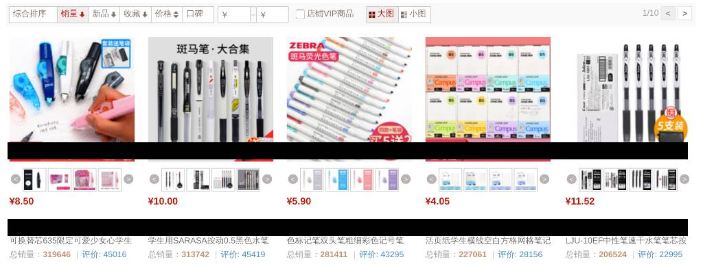
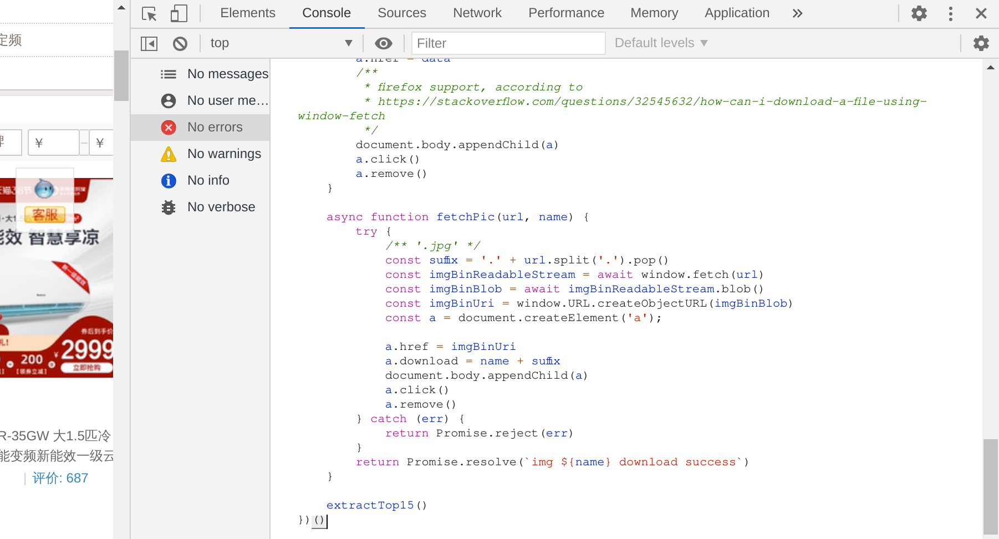
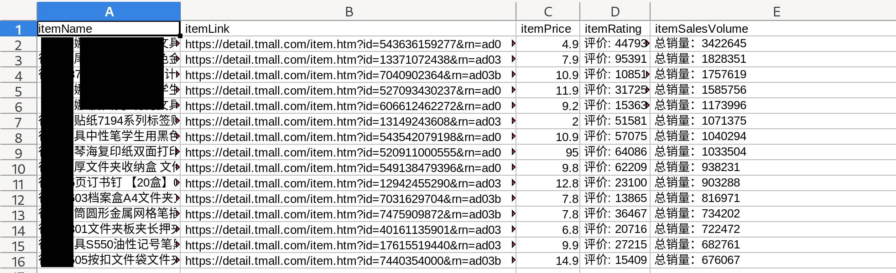
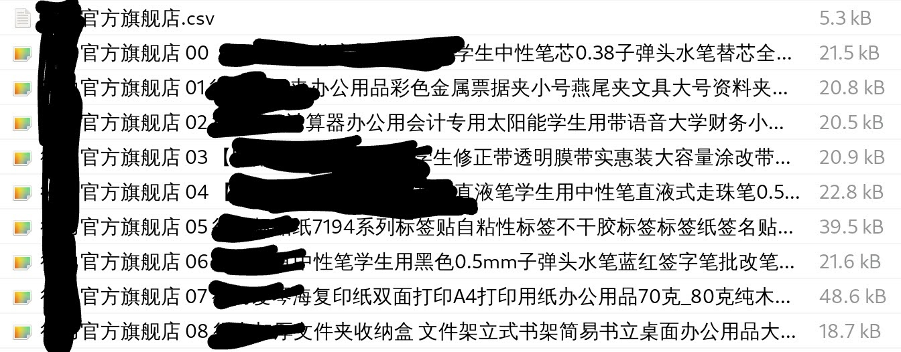

# Taobao-TMALL Items-Data Extractor
A script for extracting items info from Taobao-TMALL shops(淘宝天猫旗舰店). 

# Definition of Nouns
+ **items category page**: the "item by sales" page from each shop. Similar to the following page:
  

# Features:
1. `tools/theDataExtractor`: Extract the info of the top 15 items, then parse and download the following files:
  1. a csv File, contains all text info.
  2. item thumbnails.

2. `src/index.ts`:
  1. open tabs, to the homepage of the shops, 
Open home-pages of shops in new browser tabs. You can then maually goes to any [items category page](#Definition of Nouns), then use theDataExtractor.

# Usage:
## Extract Items Infomation From TMALL shops
   + paste the `tools/theDataExtractor.js` in the console of a **item category page** of a **TMALL shop**, as showed here, then hit Enter:
   

## Auto Open TMALL Shops by "shopName" in Browser Tabs
(modify the "shopNames" parameter in tools/puppeteerStealthPoC.ts)
After installing node.js and npm install intially:
1. npm run dev.
2. When the Taobao main page loads, login and wait.

# Result Example
  + 
  + 

