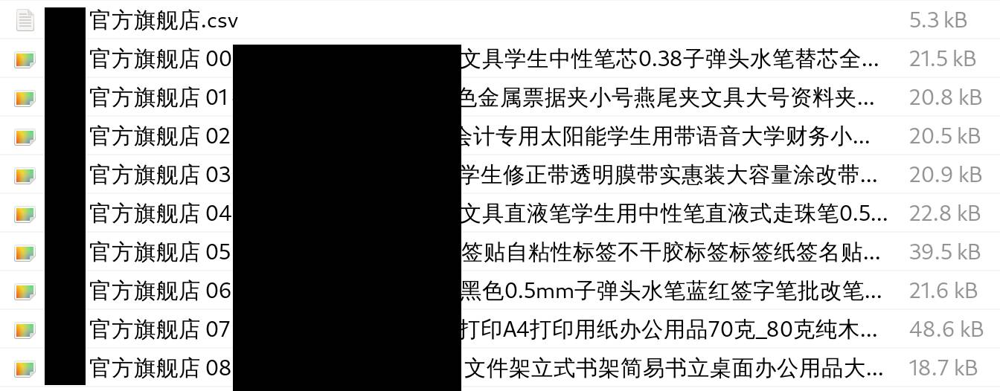

# Taobao-crawler
A web crawler targeting Taobao(淘宝). 

# Definition of Nouns
+ **items category page**: the "item by sales" page from each shop.
  

# Features:
1. tools/theDataExtractor: Extract the info of top 15 items, parse and auto download as csv File. And auto download their pictures.
  - copy the code to the console of an opened [items category page](#Definition of Nouns)
  - allow the files to be downloaded if asked. 

2. src/index.ts: Open home-pages of shops in new browser tabs. You can then maually goes to any [items category page](#Definition of Nouns), then use theDataExtractor.

# Initial Setup:
1. Download and install [NodeJs](https://nodejs.org/)
2. npm install

# Usage:
(modify the "shopNames" parameter in tools/theDataExtractor.js)
1. npm run dev.
2. When the Taobao main page loads, login and wait.
3. when shop tab is opened, find any [items category page](#Definition of Nouns) and open the console of the browser tab.
4. copy the content of `tools/theDataExtractor.js` into the console and hit the Enter key.
5. check the files dowloaded.

# Result Example
  + 
  + 

